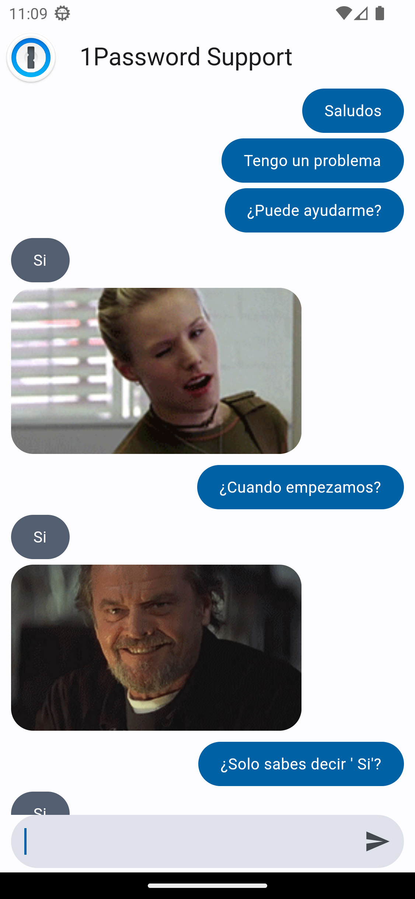
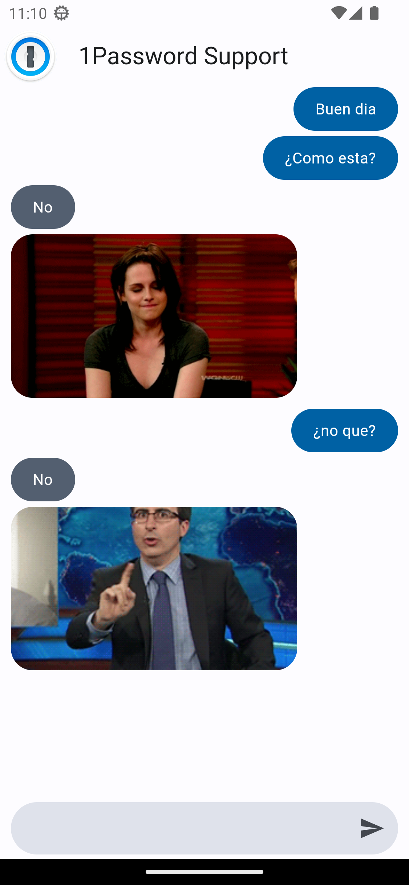

# Yes No App

El proyecto "Yes No App" es una aplicación de chat desarrollada en Flutter, diseñada para dispositivos Android, que responde a preguntas con respuestas de "sí" o "no". La aplicación utiliza la API de 'https://yesno.wtf/' para enviar una respuesta junto con un GIF que representa visualmente la respuesta.

Características principales:
- Interfaz de chat intuitiva y fácil de usar.
- Envío de mensajes de texto a la aplicación.
- Respuestas automáticas a preguntas que terminan con el signo '?'.
- Integración con la API de 'https://yesno.wtf/' para obtener respuestas y GIFs correspondientes.
- Visualización de respuestas y GIFs en el chat en tiempo real.

    
    

